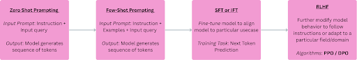

# Training LLM

## The Complete Guide to Training Large Language Models: From Pre-training to Human Alignment

*A comprehensive deep dive into the multi-stage journey of creating intelligent, aligned AI systems*

In the rapidly evolving landscape of artificial intelligence, Large Language Models (LLMs) have emerged as the crown jewels of modern AI research. There is a multi-stage training process that transforms raw computational power into something approaching human-like understanding.

The training of an LLM isn't a monolithic process; it's a carefully orchestrated symphony of techniques, each playing a crucial role in the final performance. Understanding this process is essential for anyone serious about the field of AI, whether you're a researcher pushing the boundaries of what's possible, an engineer implementing these systems, or a leader making strategic decisions about AI adoption.

## The Training Pipeline: A Bird's Eye View

Before we dive into the technical depths, let's establish our roadmap. LLM training fundamentally occurs in two major phases:

1. **Pre-training**: Where models learn the statistical patterns of language from vast amounts of text
2. **Post-training**: Where models learn to behave like helpful, harmless, and honest assistants

Think of pre-training as teaching a child to read by exposing them to every book in the library, while post-training is like teaching them manners, ethics, and how to have meaningful conversations. Both are essential, but they serve very different purposes.

## Phase 1: Pre-training - Building the Foundation

### Data - The Raw Materials

Pre-training begins with an almost unfathomable amount of text data. We're talking about articles, research papers, books, websites, transcriptions—essentially the written knowledge of humanity, scraped and curated from across the internet. This isn't just "big data"; it's data on a scale that would have been incomprehensible just a decade ago.

The quality and diversity of this data fundamentally shape what the model can learn. Include high-quality academic papers, and your model develops sophisticated reasoning abilities. Add diverse cultural content, and it learns to understand different perspectives and contexts. This is why data curation has become an art form in itself.

### The Learning (Model Training) Task

At its core, pre-training is deceptively simple: given a sequence of words, predict what comes next. This is called **Causal Language Modeling** or **Next Token Prediction**.

> Please refer to [this article](https://example.com) to understand more about Causal Language Modelling

But don't let the simplicity fool you. This single task, when performed at scale, forces the model to learn an incredible array of skills:

- Grammar and syntax
- Factual knowledge about the world
- Reasoning patterns
- Cultural context and nuance
- Mathematical relationships
- Even some forms of common sense

### Training Objective Function: Cross-Entropy Loss

The training objective is mathematically elegant: we minimize the aggregated cross-entropy loss between the model's predictions and the actual next tokens across all positions in all sequences.

At each step, the model learns to assign probability distributions over its entire vocabulary. When it predicts correctly, the loss is low. When it's wrong, the loss is high, and backpropagation adjusts the model's billions of parameters to do better next time.

### The Economic Reality: Why Pre-training Happens Infrequently

Pre-training is extraordinarily expensive—we're talking millions of dollars in compute costs for state-of-the-art models. This is why major models have distinct "knowledge cutoffs"; they're snapshots of internet knowledge at specific points in time. Pre-training happens relatively infrequently because organizations can't afford to do it constantly.

## Phase 2: Post-training - From Knowledge to Wisdom

If pre-training gives a model knowledge, post-training gives it wisdom, or at least, the ability to use that knowledge responsibly and helpfully. As Andrej Karpathy eloquently put it: "Pre-training gives you the knowledge of the internet, post-training gives you the persona and style of an assistant."

Post-training serves several critical purposes:

- **Alignment**: Making the model behave according to human values and preferences
- **Safety**: Preventing harmful, biased, or inappropriate outputs; restricting the model by putting guardrails
- **Usability**: Teaching the model to follow instructions and maintain helpful conversations, adhere to the structure of input prompts and output completions
- **Specialization**: Adapting the model for specific domains or use cases

### The Two Paths: Parameter Updates vs. Prompt Engineering

Post-training can be approached in two fundamentally different ways:
*(Here, by Parameter, we mean model weights)*

1. **Without Parameter Updates**: Using clever prompting techniques to guide behavior
2. **With Parameter Updates**: Actually modifying the model's weights through additional training

Let's explore both approaches.

## Post-training Without Parameter Updates: The Art of Prompting

### Zero-Shot Prompting: Trusting the Foundation

Zero-shot prompting is perhaps the most elegant approach. We simply give the model clear instructions and hope its pre-training has equipped it with the necessary knowledge and reasoning abilities.

The mathematical formulation is straightforward:
```
P(y | x, θ, Instruction)
```

Where:
- `y` → output completion
- `x` → input query
- `θ` → Model parameters
- `Instruction` → Instruction added to query in prompt

We compute the most likely completion:
```
y* = argmax P(y | x, θ, Instruction)
```

The beauty of zero-shot prompting lies in its simplicity. You craft your instruction carefully, provide your query, and trust that the model's vast pre-training has prepared it for this moment.

**Prompt Structure:**
```
Instruction: [Clear, specific guidance]
Input: [Your query]
```

### Few-Shot Prompting: Learning by Example

Sometimes zero-shot isn't enough. Few-shot prompting provides the model with examples, enabling it to learn patterns and adapt its behavior through in-context learning—one of the most remarkable emergent properties of large language models.

For k-shot prompting, our probability becomes:
```
y* = argmax P(y | x, θ, {(x₁, y₁), (x₂, y₂), ..., (xₖ, yₖ)}, Instruction)
```

**Optimal Prompt Construction:**
```
Instruction: [Task description]
Input: x₁
Output: y₁
Input: x₂
Output: y₂
...
Input: xₖ
Output: yₖ
Test query: x
```

**Aggregated:** (Instruction + Examples + Input query) AS prompt

**Best Practices for Few-Shot Prompting:**
- **Diversity**: Choose examples that cover different aspects of the task
- **Difficulty Gradient**: Order examples from simple to complex
- **Consistent Formatting**: Maintain the same structure across all examples and Input query

**Challenges:**
- **Context Window Constraints**: Examples consume valuable tokens
- **Order Sensitivity**: The sequence of examples can significantly impact performance
- **Task Leakage**: Sometimes the model learns the wrong pattern

### Chain of Thought Prompting: Teaching the Model to Think

For complex reasoning tasks such as mathematics, logical puzzles, and multi-step problems, Chain-of-Thought (CoT) prompting has proven revolutionary. Instead of just showing the model input-output pairs, we show the reasoning process. These added reasoning steps enhance performance and help the model approach problems/queries more analytically.

This approach is particularly powerful for:
- Mathematical problems
- Competitive coding challenges
- Legal reasoning
- Complex analytical tasks

CoT prompting essentially teaches the model to "show its work," leading to more accurate and explainable results.

## Post-training With Parameter Updates: Fine-tuning for Alignment

When prompting techniques aren't sufficient, we turn to methods that actually modify the model's parameters. This is where things get sophisticated.

Primarily, there are 2 types of fine-tuning methods:

1. **Supervised Fine Tuning (SFT)** (Instruction Fine Tuning)
2. **Reinforcement Learning through Human Feedback (RLHF)**
   - **DPO**: Direct Policy Optimization
   - **PPO**: Proximal Policy Optimization

### The Sequential Approach: Building Layer by Layer

The industry standard approach follows a specific sequence:
```
Pre-trained Model → SFT → RLHF
```

Sometimes, if SFT performance is sufficient:
```
Pre-trained Model → SFT
```

Rarely, but occasionally:
```
Pre-trained Model → RLHF
```

This sequential approach ensures that each stage builds upon the previous one, creating increasingly aligned and capable models.

Chronology in which above mentioned methods should be applied to modify LLM's behaviour to align better with user preferences data



Next, let's learn more about SFT and RLHF in more detail.

## Supervised Fine-Tuning (SFT)

SFT is where we begin to shape the model's behavior through direct instruction. The core principle is simple: increase the likelihood of generating sequences that match our training data.

### Two Flavors of SFT

1. **Instruction Fine-Tuning (IFT)**: Teaching the model to follow specific formats for input prompts and output completions, instructions, and conversational patterns. Model is fine-tuned using instructional/conversational data

2. **Domain Adaptation**: Making the model an expert in specific fields (medicine, law, coding). Adapt the model to a particular knowledge base, understand its vocabulary in detail, and be aware of all nuances of the field. Text data from specific domains is used to fine-tune model using same objective function and Training task (Next token prediction) as we used in pre-training

### Implementation Strategies

#### Full Parameter Fine-Tuning:
- Updates all model parameters
- Uses very low learning rates to prevent catastrophic forgetting
- Requires substantial computational resources
- Offers maximum flexibility and performance

#### Parameter Efficient Fine-tuning (PEFT):

The game changer here is **LoRA (Low-Rank Adaptation)**, which has revolutionized how we approach fine-tuning. LoRA is the technique used to fine-tune LLMs, in which we don't have to update all model parameters. LoRA only trains a fraction of total parameters, hence being a more efficient and faster way to fine-tune LLMs with billions of parameters.

**The LoRA Insight:** Most weight matrices in neural networks are not full-rank—they can be approximated using lower-dimensional representations.

Original weights of pre-trained model are frozen, we learn adapters for each weight layer. These learned adapters are then added to the original pre-trained model weights. Adapters are made by decomposing the weight matrix into 2 separate matrices.

**The Mathematics:**
- Original parameters: `d × k`
- LoRA parameters: `(d × r) + (r × k) = r × (d + k)`
- When `r << min(d, k)`, we get massive parameter reduction

There is also a quantized version of LoRA, known as **Q-LoRA**. This is much more efficient and fast in terms of training and inference latency, and resources required.

**Optimizations in Q-LoRA over LoRA:**
*(Note: For this, you need to have a basic understanding of Quantization)*

- Q-LoRA takes this further by quantizing the base model to 4 bits
- **Block-wise quantization**: Addresses outlier problems in quantization
- It addresses the problem of outliers while calculating quantization parameters (Scale and zero point)

**What is an outlier in Quantization, or while learning quantization parameters to convert one datatype to another (f32 to f16, etc):**
→ If there is an outlier, then mapping from one data type to another doesn't happen optimally, with some bins having very few or no candidates, while other bins are overcrowded. Hence, reducing the accuracy of the model.

## Reinforcement Learning through Human Feedback (RLHF): The Alignment Revolution

RLHF traditionally refers to using reinforcement learning techniques to align models with human preferences. When the level of alignment with user preferences is not achieved from Supervised Fine-Tuning (SFT), we need to further improve model performance to make it adhere to specific patterns and align with preferences suited for its use case.

The goal is to improve the behavior and performance of models, aligning them closer to desired human behaviors. We further modify model behavior to follow instructions and adjust the model's probability distribution to better suit a particular field or domain. This involves adapting the model's next token probability distribution to follow innate patterns and understanding of a particular field. We use RLHF to make the model learn preferences from data using algorithms like DPO and PPO.

### The Foundation: Why Traditional Fine-Tuning Isn't Enough

Traditional supervised fine-tuning (SFT) teaches models to mimic patterns in curated datasets. While effective for many tasks, SFT has fundamental limitations when it comes to aligning models with nuanced human preferences. Consider these scenarios:

- **Subjective Quality**: How do you teach a model that one joke is funnier than another?
- **Contextual Appropriateness**: When should a model refuse to answer a question?
- **Conversational Nuance**: What makes a response helpful versus merely accurate?

RLHF addresses these challenges by incorporating human judgment directly into the training process. Instead of learning from static examples, models learn from dynamic preference comparisons, enabling them to capture the subtle aspects of human communication that make interactions feel natural and aligned.

### The Core Hypothesis

**Why RLHF is used alongside SFT or individually for post-training to better align LLM output with user preferences:**

The key insight driving RLHF's effectiveness is the necessity of negative examples. When models see both good and bad completions during training, they develop a more nuanced understanding of quality. This allows them to:

- Decrease probabilities of generating undesirable sequences
- Increase probabilities of generating preferred responses
- Generalize better to unseen scenarios by understanding the boundaries of acceptable behavior

### The Four-Phase RLHF Pipeline

RLHF is typically implemented as a four-phase process, each building upon the previous stage:

1. **Phase 1: Foundation Training**
   The journey begins with standard next-token prediction on large-scale text corpora. This phase establishes the model's fundamental language understanding and generation capabilities.

2. **Phase 2: Supervised Fine-Tuning (SFT)**
   While not strictly required, SFT has proven empirically beneficial. During this phase, models learn to follow instructions and maintain conversational structure using curated demonstration data. This creates a strong foundation for subsequent preference learning.

3. **Phase 3: Reward Model Training**
   This is where human preferences enter the equation. A specialized model learns to predict human preference scores, effectively serving as a proxy for human judgment during training.

4. **Phase 4: Policy Optimization**
   The final phase uses reinforcement learning algorithms (PPO, DPO) to optimize the model's policy based on the reward signal, balancing performance improvements with stability constraints.

### Challenges and Disadvantages of RLHF

- **Expensive**: Heavy dependency on humans to create preference data
- **Subjective**: Human preferences vary and can be inconsistent
- **Adversarial concerns**: Bad actors could modify the model to output detrimental content that is harmful to society
- **Overfitting and Biases**: Training an RL algorithm is complex. The algorithm tends to overfit on patterns that yield rewards; it is important to train in a controlled environment

Before discussing the two prominent post-training RLHF techniques - DPO and PPO - we need to understand reward models, as they are an integral part of the training process for both approaches.

## Reward Model

### Introduction

Reward models have transformed LLM research by incorporating human preferences directly into the training process. A reward model (RM) is a specialized LLM—usually derived from the LLM we are currently training—that is trained to predict a human preference score given a prompt and a candidate completion as input. A higher score from the RM indicates that a given completion is more likely to be preferred by humans.

The reward model takes a sequence of text as input and outputs a single reward value that numerically predicts how much a user/human would reward or penalize that text. We typically train a separate reward model on human preference data. The reward model rϕ takes a prompt x and a completion y (a sequence of tokens) and outputs a scalar reward.

**Input:** Prompt (x) + Completion (y)
**Output:** Scalar reward score rϕ(x, y)

### Data Required for Reward Model Training

**Data Required:**
User preference data - for each input prompt, we need ordering/preference rankings of its completions.

**How to create this data:**
1. We need a dataset of prompts
2. For each prompt, generate several completions from the base/reference model
3. Rate the completions to distinguish good completions from bad ones

**How are multiple completions generated for a single prompt?**
Use sampling during decoding, such as top-k or top-p (nucleus) sampling techniques. Temperature is also a hyperparameter that can make the decoding process more random/creative or more deterministic. By using sampling and tuning temperature accordingly, we can sample multiple completions for a prompt.

### Methods for Rating Completions

1. **Single Point Scoring**: Given a prompt and completion, assign an absolute score on a scale (e.g., 0-10). This approach is not feasible because human annotators cannot consistently assign numerical ratings due to individual bias and conditioning. Alignment on the meaning of absolute ratings is challenging, so this approach is not prominently used in industry.

2. **Reference-based Scoring**: We need reference ground truth completions for each prompt in the dataset, then rate any generated completion relative to this reference. This requires reference completions for all prompts, which often involves manual human annotation and validation, making it not always feasible.

3. **Pairwise Scoring**: For a prompt, we generate several completions and take pairs of completions, then order them based on which is better for the input prompt. This approach is optimal and most commonly used in industry. It's analogous to ranking problems where we have a list of items for a query and order between pairs of items in the form of triplets: (query, item_winner, item_loser). We use pairwise loss functions to learn this ordering instead of learning absolute scores.

In this article, we will be concentrating on the pairwise scoring approach.

**Common methods for pairwise ordering:**
- **Human annotators**: Use humans to determine preference between completions
- **Larger LLM as judge**: Use a more sophisticated LLM to determine preference between completions

### Preference Data Format

After creating user preference data, we use it as triplets of prompt, winner completion, and loser completion:

```
Dpref = {(x(i), yw(i), yl(i))}i=1N
```

where `yw` = preferred completion, `yl` = dispreferred completion.

Preference data is used extensively in LLM post-training. Such data consists of many different prompts. For each prompt, we have a pair of candidate completions, where one completion has been identified by a human or model as preferable to the other.

### Model Architecture

**Base Model:** Usually initialized from the supervised fine-tuned (SFT) model but with the language modeling head replaced by a regression head (single output neuron).

Reward models are specialized LLMs with an additional classification head used to classify a completion as preferred or not preferred.

**Critical Design Choices:**
- **Parameter Efficiency**: Only the final linear layer is trained (base model frozen)
- **Reward Extraction**: Use the last token embedding (EOS token)
- **Normalization**: LayerNorm before reward head

### Objective Function

The loss function used is analogous to ranking loss used in pairwise ranking problems, such as contrastive loss, triplet loss, and ranking loss. These pairwise objective functions aim to predict user preferences by learning to rank items rather than simply predicting ratings or binary relevance.

This objective function is derived from the **Bradley-Terry model**. The Bradley-Terry model is a statistical model used to rank paired comparison data based on the relative strength or performance of items in the pair. Given two events i and j drawn from the same distribution, the Bradley-Terry model defines the probability that item i wins or is preferred compared to item j.

In the context of LLMs, items i and j are two completions generated by the same LLM from the same prompt (same distribution). The RM assigns a score to each completion, and we use Bradley-Terry to express probabilities for pairwise comparisons.

The goal is to maximize the likelihood that the preferred completion has a higher reward than the dispreferred one.

**Loss function:** 
Negative log likelihood of the difference between reward values of preferred completion and dispreferred completion (let's call this difference - δ)

```
L(ϕ) = -1/N ∑(i=1 to N) log σ(rϕ(x(i), yw(i)) - rϕ(x(i), yl(i)))
```

where σ is the sigmoid function, and the above equation represents the average loss values across a batch.

**Intuition:** The loss function maximizes the reward value for yw and minimizes the value for yl. Since both log and sigmoid are monotonically increasing functions, the loss is defined as the negative log of sigmoid of δ = rϕ(x, yw) - rϕ(x, yl). When δ is maximum, loss is minimum; when δ is minimum, loss is maximum. Thus, this loss function implicitly enforces δ > 0.

### Training Process

1. Take a sample from created User preference dataset. Each sample is a triplet - (x, yw, yl), where x is input prompt, yw is preferred completion, and yl is dispreferred completion

2. For a prompt-completion pair, the reward model outputs a scalar: `rϕ(x,y) = RMϕ(concat(x,y))`
   We compute rewards for rϕ(x,yw) and rϕ(x,yl) (also known as Forward pass)

3. Compute the difference: `δ = rϕ(x,yw) - rϕ(x,yl)`

4. Compute loss `L(ϕ) = -log(σ(δ))`

5. Minimize Loss via Gradient descent and backpropagation

### Reward Model Evaluation

| Metric | Formula | Purpose |
|--------|---------|---------|
| Pairwise Accuracy | `1/N ∑ 1[rw > rl]` | Basic ranking performance |
| Kendall's Tau | `(concordant - discordant) / (n choose 2)` | Rank correlation |

## DPO - Direct Preference Optimization

### Introduction

DPO bypasses the explicit reward modeling and RL fine-tuning steps. Instead, it reparameterizes the RLHF problem such that the optimal policy can be extracted directly from the preference data using a simple classification loss (like binary cross-entropy).

DPO is an alternative to RL-based alignment methods (like PPO) within the RLHF pipeline. It replaces the RL step with a direct supervised loss.

### Data Requirements

DPO requires user preference data to train the policy (LLM). DPO eliminates the need for a reward model by directly modeling user preference data.

User preference data is generated in almost the same way as discussed in the Reward Model section. We need a dataset of prompts and a reference model (generally a pre-trained model or SFT model). Then we generate multiple completions for each prompt and use one of the following methods to obtain preferences:

1. **Human annotation**: Humans annotate the data
2. **LLM as a judge**: Use a larger, more sophisticated model to determine preference
3. **Syntactic and Semantic measures**: 
   - If we have reference completions or specific words/phrases that help filter good and bad completions
   - For example, we are aligning LLM to not generate explicit content, then we can use some tagged words/tokens OR reference completions that are tagged as explicit, to classify if a generated completion is explicit or not

**Syntactic metrics/measures:**
- **Jaccard Similarity**: Calculates similarity between two sets by dividing the size of their intersection by the size of their union
- **BLEU (Bilingual Evaluation Understudy)**: Measures the precision of n-grams (sequences of words). The higher the BLEU score, the better
- **ROUGE (Recall-Oriented Understudy for Gisting Evaluation)**: Focuses on recall. Different ROUGE variants (like ROUGE-N, ROUGE-L, etc.) can be used, such as n-gram overlap or longest common subsequences

**Semantic Metrics:**
- **BERTScore**: Cosine similarity between vector representations for semantic similarity

After creating user preference data, we use it as triplets of prompt, winner completion, and loser completion:

```
Dpref = {(x(i), yw(i), yl(i))}i=1N
```

where `yw` = preferred completion, `yl` = dispreferred completion.

### Objective Function

This is the crux of the DPO model; the loss function used to update policy or train LLM is as defined:

```
L_DPO(θ) = -E[(x,yw,yl)~Dpref] [log σ(β log(πθ(yw|x)/πref(yw|x)) - β log(πθ(yl|x)/πref(yl|x)))]
```

Where:
- **πθ**: Updated policy with updated weight parameters (anytime during training and after training)
- **πref**: Initial SFT model we are using to conduct fine-tuning, this acts as a base model upon which we need to improve and align our model according to user preference data
- **π(y|x)**: Joint Probability of completion sequence 'y' given prompt 'x' under the model or policy π

In the context of LLMs, it would be the joint or aggregated probability of the whole sequence. Let's say y has n tokens (y1, y2, y3, y4, ..., yn) that are generated from LLM. So:

```
π(y|x) = p(y1|x) * p(y2|x,y<2) * p(y3|x,y<3) * ... * p(yn|x,y<n)
```

Like PPO, DPO's objective function maximizes rewards with a KL constraint over the policy such that the updated policy (πθ) doesn't diverge significantly from the reference policy (πref).

DPO loss implicitly encodes the same reward maximization objective that RL algorithms explicitly solve. DPO eliminates explicit reward modeling by substituting the reward model with the preference model (Bradley-Terry).

### Intuitive Understanding

The DPO loss function accomplishes two things:

1. **Increases probability of winner completion and decreases probability of loser completion** under policy πθ
2. **Improves upon the reference policy** by measuring how much more the fine-tuned policy πθ prefers the preferred response yw over the dispreferred one yl, compared to the reference policy πref

The loss encourages πθ to increase the preference gap over the reference policy, learning to be more aligned with user preferences without deviating too far from the original model. This provides stable fine-tuning behavior and avoids overfitting or collapsing diversity in completions.

**DPO loss tells the model:** "Prefer the good answers more than the bad ones — but only more than the base model already does, and not blindly."

### Model Training

1. Take a sample from User preference dataset. Each sample is a triplet - (x, yw, yl), where x is input prompt, yw is preferred completion, and yl is dispreferred completion

2. For each triplet (x, yw, yl) calculate probabilities of yw and yl from updated policy and reference policy → πθ(yw|x), πθ(yl|x), πref(yw|x), πref(yl|x)

3. Calculate L_DPO

4. Minimize Loss via Gradient descent and backpropagation

## PPO - Proximal Policy Optimization

### Introduction

PPO is a reinforcement learning algorithm that trains a policy by optimizing a surrogate objective function. PPO typically uses an actor-critic architecture where the actor (policy) decides which action to take, and the critic (value function) estimates the value of the current state to help the actor update more effectively.

**Key concepts of PPO:**
1. **Actor-Critic Architecture**: The actor (policy) decides actions, and the critic (value function) estimates state values for more effective updates.
2. **Surrogate Objective**: PPO optimizes a surrogate objective that clips the policy update to prevent excessively large changes, hence "proximal".
3. **Advantage Estimation**: The advantage function A(s,a) = Q(s,a) - V(s) measures how much better an action is compared to the average action in that state. PPO uses Generalized Advantage Estimation (GAE).

### Key Components of PPO

**st: State at timestep t**
For LLMs, states are defined as prompt x + tokens of completion sequence generated till current timestep t: `st → x + y1 + y2 + ... + yt`

**at: Action taken by policy πθ while at st**
For LLMs, action is sampling of the next token based on a probability distribution over all tokens generated by the model (LLM)

**rt: Reward value (a scalar) at timestep t**
Reward value is calculated for the whole completion at once by the Reward model, as we don't have a mechanism to calculate reward for incomplete sequences. But this reward value is propagated to all timesteps using the method below:

```
rt = rT * γ^(T-t)
```

Where:
- T → Total timesteps (or tokens) in completion sequence
- t → current timestep (or token)
- γ → Discount factor (value between 0-1)
- Gradually decreasing reward value as we move away from the final timestep

**rT: scalar value, output of reward model (RMΨ) for a pair of prompt and completion (x, y)**
Represents how good a completion is given prompt x

**RMΨ: Reward model parameterized by weights Ψ**
Reward model is pretrained on user preference data, used in PPO training to steer the model in the right direction. It is used in the estimation of the Advantage and training of the Value function model. Reward value is used in the Loss term corresponding to Value function model.

Reward model is fixed during PPO training. Only the policy (actor) and value function (critic) are updated.

KL-divergence penalty between the current policy and the initial pre-trained model (or the reference policy) is often added to the reward function output to prevent the policy from deviating too far from the original pre-trained model. The reward can be adjusted as:

```
R_total = RMΨ(x,y) - β * KL(π_θ(·|x) || π_ref(·|x))
```

where β is a hyperparameter. This is crucial to avoid the model generating gibberish to hack the reward.

**Vφ(st): Value function for state st**

Value Function gives the average possible outcome from a state (st) under the policy (πθ). It is the expected reward value over all possible trajectories from this state (st). In simpler terms, it is the expected value of aggregated future rewards. This tells us how good a response till now is based on its expected future rewards, regardless of how it would be in future states.

More formally, starting from the current step t to the last step T, Expectation is over all trajectories sampled from the policy or all possible completions of response so far. But tracking all possible completions and finding the expected value is virtually impossible. At each step, we have ~50k tokens, so total completions would be around (50k)^T, where T is the total length of the completion. Hence, calculating expectation is impossible, so Vφ is learned by a model to estimate it. Value function model is parameterized by φ.

The policy (πθ) and value function (Vφ) often share the same transformer base (shared parameters). We have two heads: one for the policy (the usual LM head) and one for the value function (a scalar output head).

Value function is learnt with a loss function that tries to minimize the distance between predicted value and actual value.

Value function output is used to estimate the Advantage.

**Ât: Advantage**
Calculated for each state-action pair (st, at), representing how much better than average the chosen action was.

Advantage is defined as:
```
At = Q(st, at) - Vφ(st)
```

Where:
- Q(st, at) is the reward value for the completion in the current trajectory. We wait for the full episode to unfold, and aggregate rewards from all steps. Here, it is not expectation, just the reward value of this particular trajectory
- Vφ(st) → average value of reward from state st under policy πθ

Estimating Q(st, at) and At is done using a method known as **General Advantage Estimation (GAE)**. Please refer to resources at the end to understand GAE in mathematical detail.

**Intuitive explanation of the Advantage used in PPO:**
As for each action, we don't have a reference probability distribution or reference response token (target distribution). Hence, PPO figures out how probabilities should be modified using a scaling factor known as Advantage. So, Advantage is defined and estimated, and used in the loss function of PPO.

This is different from Supervised fine tuning, as there we have some idea of predicted and target probability distribution to steer our model, but here model learns by taking action and getting a reward for that action.

At each step, we have a state (st) and we need to decide what action (at) to perform, but we don't know the correct action yet, so we just compare our action against the average action. This